# Project Architecture

## Overview

The `learn-git` project is a documentation-based web application designed to teach Git concepts and commands. It is built using **Next.js**, **TypeScript**, **Tailwind CSS**, and **MDX** for rendering markdown-based documentation.

## Directory Structure

Below is a high-level representation of the directory structure:

```mermaid
graph TD;
    root[learn-git]
    root -->|Configuration| config["Configuration Files"]
    root -->|Application| app["App"]
    root -->|Components| components["Components"]
    root -->|Content| contents["Documentation"]
    root -->|Hooks| hooks["Custom Hooks"]
    root -->|Library| lib["Utility Library"]
    root -->|Public Assets| public["Public"]
    root -->|Styles| styles["CSS & Styling"]
    root -->|GitHub Actions| github[".github Workflows"]

    config --> README["README.md"]
    config --> LICENSE["LICENSE"]
    config --> package["package.json"]
    config --> tailwind["tailwind.config.ts"]
    config --> tsconfig["tsconfig.json"]

    app --> layout["layout.tsx"]
    app --> page["page.tsx"]
    app --> api["API Routes"]
    app --> docs["Docs Rendering"]

    components --> ui["UI Components"]
    components --> markdown["Markdown Components"]
    components --> magicui["Magic UI Components"]

    contents --> getting_started["Getting Started"]
    contents --> essential_commands["Essential Commands"]
    contents --> file_management["File Management"]

    hooks --> useToast["use-toast.ts"]
    hooks --> useCursor["useCanvasCursor.ts"]

    lib --> markdown["Markdown Parser"]
    lib --> routes["Routes Configuration"]
    lib --> utils["Utilities"]

    public --> assets["Static Assets"]
    styles --> globals["Global Styles"]
    github --> workflows["CI/CD Workflows"]
```

## Explanation

### 1. **Configuration Files**
Contains project metadata, dependencies, TypeScript, ESLint, and Tailwind CSS configurations.

- `package.json` - Dependencies and scripts.
- `tailwind.config.ts` - Tailwind CSS setup.
- `.eslintrc.json` - Linting rules.

### 2. **App Directory**
Contains the core Next.js pages and API routes.

- `layout.tsx` - Main layout for the application.
- `page.tsx` - Entry page.
- `api/commit/route.ts` - API route for handling commits.
- `docs/` - Dynamic documentation pages.

### 3. **Components Directory**
Contains reusable React components structured into subdirectories:

- `ui/` - UI elements like buttons, tooltips, modals.
- `markdown/` - Components to handle markdown rendering.
- `magicui/` - Advanced UI animations and interactions.

### 4. **Contents Directory**
Stores Git documentation in **MDX** format, organized into topics:

- `getting-started/` - Setup and installation guides.
- `essential-commands/` - Basic Git commands.
- `file-management/` - Managing `.gitignore` and `.gitkeep`.

### 5. **Hooks Directory**
Contains custom React hooks:

- `useToast.ts` - Toast notifications.
- `useCanvasCursor.ts` - Custom cursor effects.
  - Read more about this hook and its companion component [here](components/canvas-cursor/README.md).

### 6. **Library (lib) Directory**
Holds utilities and helper functions:

- `markdown.ts` - Markdown processing.
- `routes-config.ts` - Defines application routes.
- `utils.ts` - General utility functions.

### 7. **Public Directory**
Stores static assets, service workers, and icons.

### 8. **Styles Directory**
Contains global CSS and syntax highlighting styles.

### 9. **GitHub Workflows**
CI/CD workflows for automated testing and deployment (`.github/workflows/`).

