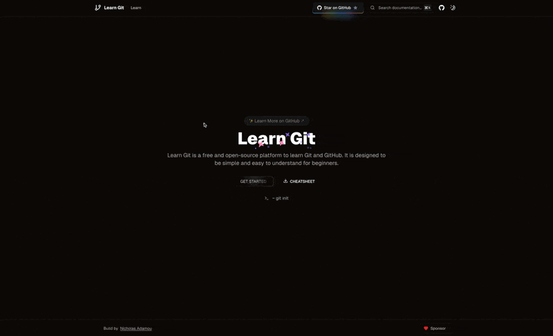

# Learn Git




A free, open-source platform crafted specifically for beginners to master Git and GitHub. Designed with simplicity and ease of understanding in mind, this platform provides an accessible entry point for anyone looking to enhance their version control skills.

## ⭐ Features

### 🐭 Frameworks

- **[Next.js](https://nextjs.org/)** - The React Framework for the Web (with **App Directory**)

### 🐮 Platforms

- **[Vercel](https://vercel.com/)** – Deploy your Next.js app with ease

### 🐒 UI

- **[Tailwind CSS](https://tailwindcss.com/)** – Utility-first CSS framework for rapid UI development
- **[Shadcn/ui](https://ui.shadcn.com/)** – Re-usable components built using Radix UI and Tailwind CSS
- **[next/font](https://nextjs.org/docs/basic-features/font-optimization)** – Optimize custom fonts and remove external network requests for improved performance
- **[MDX](https://mdxjs.com/docs)** – Markdown for the components

### 🐴 Code Quality

- **[TypeScript](https://www.typescriptlang.org/)** – Static type checker for end-to-end type safety
- **[Prettier](https://prettier.io/)** – Opinionated code formatted for consistent code style
- **[ESLint](https://eslint.org/)** – Pluggable linter for Next.js and TypeScript

### 🐑 Performance

- **[Vercel Analytics](https://vercel.com/analytics)** – Real-time performance metrics for your Next.js app

## 📦 Apps and Packages

- `web`: The main Next.js application
- `UI`: Shared UI components

## 🚀 Getting Started

### Installation

1. Clone the repository:

   ```bash
   git clone https://github.com/nicholasadamou/learn-git.git
   cd learn-git
   ```

2. Install dependencies:

   ```bash
   npm install
   # or
   yarn install
   # or
   pnpm install
   # or
   bun install
   ```

3. Create a `.env.local` file in the root directory and add the following environment variables:

   ```bash
   GITHUB_TOKEN=<YOUR_GITHUB_TOKEN>
   ```

## Development

### Running the Development Server

Start the development server with the following command:

```bash
npm run dev
# or
yarn dev
# or
pnpm dev
# or
bun dev
```

Open [http://localhost:3000](http://localhost:3000) in your browser to view the application.

You can start editing the page by modifying `app/page.tsx`. The page will auto-update as you edit the file.

This project uses [`next/font`](https://nextjs.org/docs/basic-features/font-optimization) to automatically optimize and load Inter, a custom Google Font.

## Learn More

To learn more about Next.js, check out the following resources:

-  [Next.js Documentation](https://nextjs.org/docs) - Learn about Next.js features and API.
-  [Learn Next.js](https://nextjs.org/learn) - An interactive Next.js tutorial.

You can also visit the [Next.js GitHub repository](https://github.com/vercel/next.js/) for more information and to contribute feedback or code.

## 📜 License

This project is licensed under the MIT License. For more information, see the [LICENSE](./LICENSE) file.

You can check out [the Next.js GitHub repository](https://github.com/vercel/next.js/).

